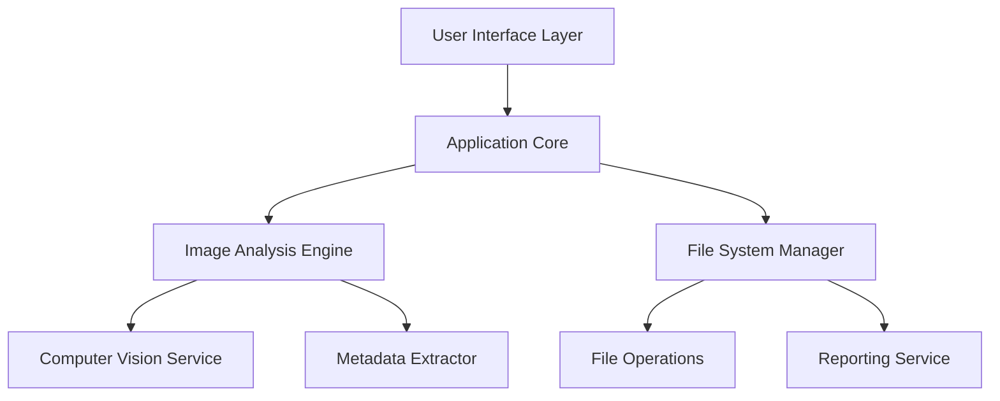

# Design Document: Photo Organizer

## Overview

The Photo Organizer is an application designed to intelligently organize and rename image files based on their content using computer vision techniques. It will analyze images to identify content, group similar images, and create a logical folder structure with descriptive names. The application will provide both CLI and GUI interfaces and support various image formats including JPEG, PNG, GIF, TIFF, BMP, and WebP.

## Architecture

The Photo Organizer will follow a modular architecture with clear separation of concerns to ensure maintainability and extensibility. The application will be structured using the following high-level components:



### Key Architectural Decisions

1. **Layered Architecture**: The application will use a layered architecture to separate concerns and facilitate testing.
2. **Plugin System**: The computer vision capabilities will be implemented as pluggable components to allow for future enhancements.
3. **Asynchronous Processing**: Image analysis and file operations will be performed asynchronously to maintain UI responsiveness.
4. **Observer Pattern**: Progress updates will be implemented using the observer pattern to notify the UI of processing status.
5. **Strategy Pattern**: Different categorization algorithms can be selected based on user preferences or image characteristics.

## Components and Interfaces

### 1. User Interface Layer

#### CLI Interface
- Parses command-line arguments
- Displays progress and results in text format
- Provides error messages and help information

#### GUI Interface
- Provides drag-and-drop functionality
- Displays visual progress indicators
- Shows preview of categorization results
- Allows configuration of processing parameters

#### Common Interface
```typescript
interface UserInterface {
  displayProgress(progress: ProgressInfo): void;
  displayError(error: ErrorInfo): void;
  displayResults(report: Report): void;
  getInputPaths(): string[];
  getOutputPath(): string;
  getProcessingOptions(): ProcessingOptions;
}
```

### 2. Application Core

The Application Core orchestrates the overall process and connects the UI with the underlying services.

```typescript
class ApplicationCore {
  constructor(
    private imageAnalyzer: ImageAnalysisEngine,
    private fileManager: FileSystemManager,
    private userInterface: UserInterface
  ) {}
  
  async processImages(inputPaths: string[], outputPath: string, options: ProcessingOptions): Promise<Report>;
  pauseProcessing(): void;
  resumeProcessing(): void;
  cancelProcessing(): void;
}
```

### 3. Image Analysis Engine

Responsible for analyzing image content and extracting metadata.

```typescript
interface ImageAnalysisEngine {
  analyzeImage(imagePath: string): Promise<ImageAnalysisResult>;
  categorizeImages(images: ImageAnalysisResult[]): Promise<CategoryTree>;
}

interface ImageAnalysisResult {
  path: string;
  contentTags: string[];
  dominantColors: Color[];
  faces: FaceInfo[];
  objects: ObjectInfo[];
  scenes: SceneInfo[];
  metadata: ImageMetadata;
}

interface ImageMetadata {
  timestamp: Date;
  geolocation?: GeoLocation;
  cameraInfo?: CameraInfo;
}

interface GeoLocation {
  latitude: number;
  longitude: number;
  street?: string;
  city?: string;
  postalCode?: string;
  country?: string;
  institutionName?: string;
  formattedAddress: string;
}
```

### 4. File System Manager

Handles all file operations and generates reports.

```typescript
interface FileSystemManager {
  createFolderStructure(categoryTree: CategoryTree, basePath: string): Promise<FolderStructure>;
  copyAndRenameFiles(images: ImageAnalysisResult[], folderStructure: FolderStructure): Promise<FileOperationResult[]>;
  generateReport(results: FileOperationResult[], options: ReportOptions): Report;
}

interface FolderStructure {
  basePath: string;
  categories: Map<string, string>; // Category name to folder path
}

interface FileOperationResult {
  originalPath: string;
  newPath: string;
  category: string;
  success: boolean;
  error?: Error;
}
```

### 5. Computer Vision Service

Provides image analysis capabilities using machine learning models.

```typescript
interface ComputerVisionService {
  detectObjects(imageData: Buffer): Promise<ObjectInfo[]>;
  detectScenes(imageData: Buffer): Promise<SceneInfo[]>;
  detectFaces(imageData: Buffer): Promise<FaceInfo[]>;
  generateTags(imageData: Buffer): Promise<string[]>;
  analyzeSimilarity(image1: Buffer, image2: Buffer): Promise<number>; // 0-1 similarity score
}
```

### 6. Metadata Extractor

Extracts and processes image metadata.

```typescript
interface MetadataExtractor {
  extractMetadata(imagePath: string): Promise<ImageMetadata>;
  parseGeolocation(latitude: number, longitude: number): Promise<GeoLocation>;
  formatTimestamp(timestamp: Date): string; // Returns in M/D/YYYY h:MMam/pm format
}
```

### 7. Reporting Service

Generates comprehensive reports of the reorganization process.

```typescript
interface ReportingService {
  generateReport(results: FileOperationResult[], structure: FolderStructure): Report;
  saveReport(report: Report, format: ReportFormat, path: string): Promise<void>;
}

interface Report {
  summary: ReportSummary;
  folderStructure: FolderHierarchy;
  fileMapping: FileMappingEntry[];
  errors: ErrorEntry[];
}

interface ReportSummary {
  totalFiles: number;
  processedFiles: number;
  skippedFiles: number;
  errorCount: number;
  foldersCreated: number;
  processingTime: number;
}

interface FolderHierarchy {
  root: string;
  folders: FolderNode[];
}

interface FolderNode {
  name: string;
  path: string;
  files: string[];
  subfolders: FolderNode[];
}
```

## Data Models

### Core Data Models

#### Image
Represents a single image file with its analysis results and metadata.

```typescript
interface Image {
  id: string;
  originalPath: string;
  format: ImageFormat;
  size: number;
  dimensions: { width: number, height: number };
  analysisResults: ImageAnalysisResult;
  newPath?: string;
}
```

#### Category
Represents a logical grouping of similar images.

```typescript
interface Category {
  id: string;
  name: string;
  description: string;
  tags: string[];
  parentCategory?: string;
  childCategories: string[];
  images: string[];
}
```

#### CategoryTree
Represents the hierarchical structure of categories.

```typescript
interface CategoryTree {
  rootCategories: Category[];
  allCategories: Map<string, Category>;
  getCategory(id: string): Category;
  addCategory(category: Category): void;
  addImageToCategory(imageId: string, categoryId: string): void;
}
```

### Processing Models

#### ProcessingOptions
Configuration options for the image processing pipeline.

```typescript
interface ProcessingOptions {
  parallelProcessing: boolean;
  maxParallelTasks: number;
  preserveOriginals: boolean;
  categorySimilarityThreshold: number;
  maxCategoryDepth: number;
  reportFormat: ReportFormat;
  filenameTemplate: string;
}
```

#### ProgressInfo
Information about the current processing progress.

```typescript
interface ProgressInfo {
  stage: ProcessingStage;
  filesProcessed: number;
  totalFiles: number;
  currentFile?: string;
  estimatedTimeRemaining?: number;
  percentComplete: number;
}
```

## Error Handling

The application will implement a comprehensive error handling strategy:

1. **Graceful Degradation**: If an image cannot be analyzed, the application will fall back to using available metadata.
2. **Error Categories**:
   - File Access Errors: Permission issues, missing files
   - Processing Errors: Corrupted images, unsupported formats
   - Analysis Errors: Failed computer vision analysis
   - System Errors: Out of memory, unexpected exceptions

3. **Error Reporting**: All errors will be logged and included in the final report.

4. **Recovery Mechanisms**:
   - Automatic retry for transient errors
   - Skip problematic files and continue processing
   - Partial results preservation in case of critical failures

```typescript
interface ErrorHandler {
  handleError(error: Error, context: ErrorContext): ErrorResolution;
  logError(error: Error, context: ErrorContext): void;
}

enum ErrorResolution {
  RETRY,
  SKIP,
  ABORT,
  USE_FALLBACK
}
```

## Testing Strategy

The testing strategy will include:

### Unit Testing
- Test individual components in isolation
- Mock dependencies for predictable testing
- Focus on core algorithms and business logic

### Integration Testing
- Test interaction between components
- Verify correct data flow between modules
- Test with real file system operations on test data

### End-to-End Testing
- Test complete workflows from UI to file system
- Verify correct categorization and organization
- Test with various image types and folder structures

### Performance Testing
- Test with large image collections
- Measure memory usage and processing time
- Verify parallel processing capabilities

### Test Data
- Create a diverse set of test images
- Include various formats, sizes, and content
- Include edge cases like corrupted files and unusual metadata

## Implementation Considerations

### Technology Stack

The application will be implemented using:

1. **Programming Language**: Python 3.9+ for cross-platform compatibility and rich ecosystem
2. **Computer Vision**: TensorFlow or PyTorch with pre-trained models for image analysis
3. **GUI Framework**: Qt for cross-platform GUI development
4. **Metadata Extraction**: ExifTool for comprehensive metadata support
5. **Geolocation**: OpenStreetMap Nominatim API for reverse geocoding
6. **Testing**: pytest for unit and integration testing
7. **Packaging**: PyInstaller for creating standalone executables

### Performance Optimization

1. **Image Processing**:
   - Use thumbnail generation for initial analysis
   - Process images in batches to optimize memory usage
   - Implement caching for intermediate results

2. **Parallel Processing**:
   - Use worker pools for CPU-bound tasks
   - Implement asynchronous I/O for file operations
   - Balance parallelism based on available system resources

3. **Memory Management**:
   - Implement progressive loading for large collections
   - Release resources after processing each batch
   - Monitor memory usage and adjust batch sizes dynamically

### Security Considerations

1. **File System Access**:
   - Validate all file paths to prevent path traversal
   - Use secure file operations to prevent data corruption
   - Handle permission issues gracefully

2. **External APIs**:
   - Implement rate limiting for external service calls
   - Validate and sanitize all API responses
   - Provide offline fallbacks when possible

3. **User Data**:
   - Do not collect or transmit user data without consent
   - Store configuration securely
   - Respect file system permissions

## Deployment and Distribution

The application will be packaged for easy distribution:

1. **Cross-Platform Packages**:
   - Windows: Standalone executable with installer
   - macOS: DMG package
   - Linux: AppImage and distribution-specific packages

2. **Dependencies**:
   - Bundle all required libraries and models
   - Minimize external dependencies
   - Provide automatic updates for ML models

3. **Installation**:
   - Provide simple installation process
   - Include default configuration
   - Offer optional components (e.g., additional ML models)