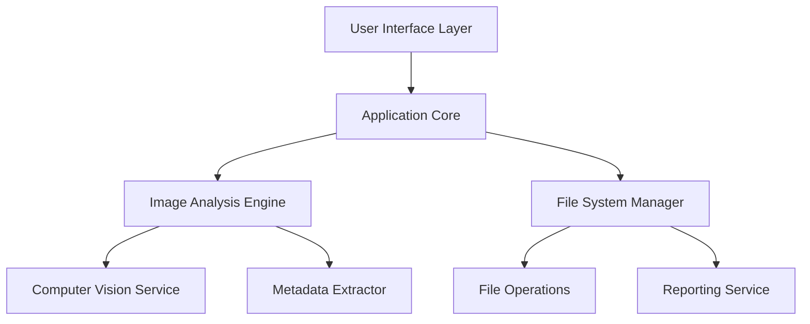

# Photo Organizer Architecture

This document describes the architecture of the Photo Organizer application, including its components, interfaces, and data flow.

## Overview

Photo Organizer is designed with a modular architecture that separates concerns and allows for extensibility. The application follows a layered architecture pattern with clear boundaries between the user interface, application core, and services.

## Architecture Diagram

## Components

### User Interface Layer

The User Interface Layer provides interfaces for users to interact with the application. It includes both a command-line interface (CLI) and a graphical user interface (GUI).

#### CLI Interface

The CLI interface allows users to run the application from the command line with various options. It is implemented in the `photo_organizer.ui.cli_parser` module.

Key classes:
- `CLIParser`: Parses command-line arguments and validates them
- `CLIProgressReporter`: Reports progress and errors to the console

#### GUI Interface

The GUI interface provides a graphical way to interact with the application. It is implemented in the `photo_organizer.ui.gui_app` module.

Key classes:
- `MainWindow`: Main application window
- `FileSelectionWidget`: Widget for selecting files and folders
- `ConfigDialog`: Dialog for configuring application settings
- `ProgressDialog`: Dialog for displaying progress

### Application Core

The Application Core orchestrates the overall process and connects the UI with the underlying services. It is implemented in the `photo_organizer.core` module.

Key classes:
- `ApplicationCore`: Main application class that coordinates the processing workflow
- `StateManager`: Manages the application state (running, paused, etc.)

### Image Analysis Engine

The Image Analysis Engine is responsible for analyzing image content and extracting metadata. It is implemented in the `photo_organizer.services.analysis` module.

Key classes:
- `ImageAnalysisService`: Coordinates the analysis of images
- `CategorizationService`: Categorizes images based on their content

### Computer Vision Service

The Computer Vision Service provides image analysis capabilities using machine learning models. It is implemented in the `photo_organizer.services.vision` module.

Key classes:
- `VisionService`: Base class for vision services
- `TensorFlowVisionService`: Implementation using TensorFlow
- `DetectionService`: Detects objects and scenes in images
- `SimilarityService`: Compares images for similarity

### Metadata Extractor

The Metadata Extractor extracts and processes image metadata. It is implemented in the `photo_organizer.services.metadata_extractor` module.

Key classes:
- `MetadataExtractorService`: Extracts metadata from images
- `GeolocationService`: Processes geolocation data

### File System Manager

The File System Manager handles file operations and generates reports. It is implemented in the `photo_organizer.services.file_system_manager` module.

Key classes:
- `FileSystemManager`: Manages file system operations
- `FileOperationsService`: Performs file operations
- `FileMappingService`: Creates file mappings

### Reporting Service

The Reporting Service generates reports of the reorganization process. It is implemented in the `photo_organizer.services.reporting` module.

Key classes:
- `ReportingService`: Generates reports
- `ReportExportService`: Exports reports in different formats

## Data Models

### Core Data Models

The core data models represent the domain entities of the application. They are implemented in the `photo_organizer.models` module.

Key classes:
- `Image`: Represents an image file with its metadata and analysis results
- `Category`: Represents a category for grouping similar images
- `CategoryTree`: Represents a hierarchical tree of categories

### Processing Models

The processing models represent the data used during the processing workflow. They are implemented in various modules.

Key classes:
- `Report`: Represents a report of the reorganization process
- `FolderNode`: Represents a folder in the folder structure
- `FileMapping`: Represents a mapping from an original file to a new file

## Data Flow

1. **Input**: The user provides input paths (files or directories) and output path.
2. **Scanning**: The application scans the input paths for image files.
3. **Analysis**: Each image is analyzed to extract content and metadata.
4. **Categorization**: Images are grouped into categories based on their content.
5. **Organization**: Images are copied to the output directory with a new folder structure.
6. **Reporting**: A report is generated with details of the reorganization.

## Parallel Processing

Photo Organizer supports parallel processing to improve performance when dealing with large image collections. The parallel processing functionality is implemented in the `photo_organizer.parallel` module.

Key classes:
- `WorkerPool`: Pool of worker threads for parallel processing
- `TaskScheduler`: Scheduler for processing tasks

## State Management

Photo Organizer uses a state management system to handle the application state during processing. The state management functionality is implemented in the `photo_organizer.state` module.

Key classes:
- `StateManager`: Manages the application state
- `ProcessingState`: Enum representing the possible states
- `StateChangeEvent`: Enum representing events that can change the state

## Error Handling

Photo Organizer implements a comprehensive error handling strategy to ensure robustness. Errors are logged and included in the final report.

Key aspects:
- Graceful degradation when an image cannot be analyzed
- Error categories for different types of errors
- Recovery mechanisms for transient errors

## Extension Points

Photo Organizer is designed to be extensible. The following extension points are available:

1. **Vision Services**: New vision services can be added by implementing the `VisionService` interface.
2. **Report Formats**: New report formats can be added by extending the `ReportExportService`.
3. **File Operations**: Custom file operations can be added by extending the `FileOperationsService`.
4. **User Interfaces**: New user interfaces can be added by using the `ApplicationCore` class.