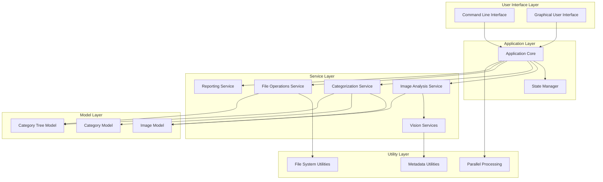
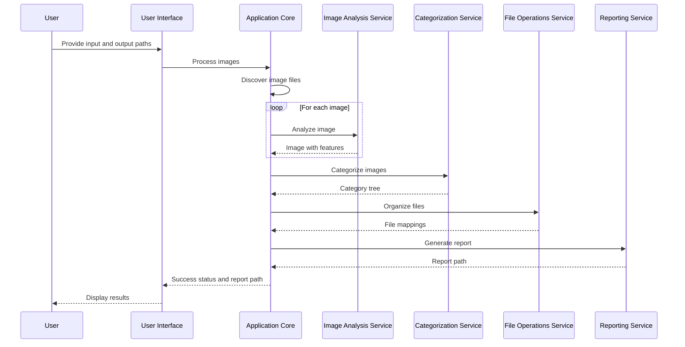
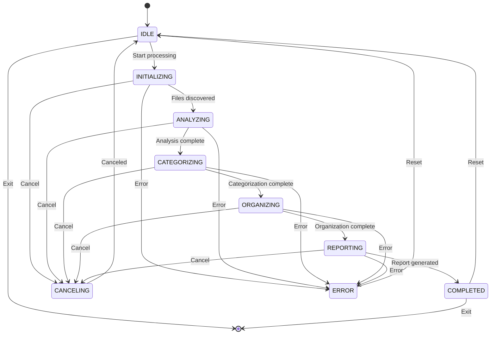

# Photo Organizer Architecture

This document describes the architecture of the Photo Organizer application.

## Overview

Photo Organizer is designed with a layered architecture that separates concerns and promotes maintainability and extensibility. The application consists of the following layers:

1. **User Interface Layer**: Handles user interactions through command-line and graphical interfaces
2. **Application Layer**: Coordinates the overall application flow and manages state
3. **Service Layer**: Implements the business logic for image analysis, categorization, and file operations
4. **Model Layer**: Defines the data structures used throughout the application
5. **Utility Layer**: Provides common utilities and helper functions

## Architecture Diagram

## Component Descriptions

### User Interface Layer

#### Command Line Interface (CLI)

The CLI provides a command-line interface for the application. It parses command-line arguments, displays progress information, and reports errors.

Key components:
- `cli_parser.py`: Parses command-line arguments
- `cli_progress.py`: Reports progress and errors to the console

#### Graphical User Interface (GUI)

The GUI provides a graphical interface for the application. It allows users to select files, configure options, and monitor progress.

Key components:
- `gui_app.py`: Main GUI application
- `file_selection.py`: File selection interface
- `config_dialog.py`: Configuration dialog
- `progress_dialog.py`: Progress dialog
- `state_monitor.py`: Monitors application state changes

### Application Layer

#### Application Core

The Application Core coordinates the overall application flow. It initializes services, manages the application state, and orchestrates the processing of images.

Key components:
- `core.py`: Main application logic
- `state.py`: Application state management
- `parallel.py`: Parallel processing utilities

### Service Layer

#### Image Analysis Service

The Image Analysis Service analyzes images to extract features such as objects, scene types, and colors.

Key components:
- `analysis.py`: Image analysis service

#### Categorization Service

The Categorization Service categorizes images based on their features and creates a hierarchy of categories.

Key components:
- `categorization.py`: Image categorization service

#### File Operations Service

The File Operations Service handles file operations such as copying, moving, and renaming files.

Key components:
- `file_operations.py`: File operations service
- `file_system_manager.py`: File system management
- `file_mapping.py`: Original to new file mapping

#### Reporting Service

The Reporting Service generates reports about the organization process.

Key components:
- `reporting.py`: Report generation service

#### Vision Services

The Vision Services provide computer vision capabilities for image analysis.

Key components:
- `vision/base.py`: Base vision service
- `vision/detection.py`: Object detection
- `vision/similarity.py`: Image similarity
- `vision/tensorflow.py`: TensorFlow implementation

### Model Layer

#### Image Model

The Image Model represents an image file with its metadata and features.

Key components:
- `models/image.py`: Image model

#### Category Model

The Category Model represents a category for organizing images.

Key components:
- `models/category.py`: Category model

#### Category Tree Model

The Category Tree Model represents a hierarchy of categories.

Key components:
- `models/category_tree.py`: Category tree model

### Utility Layer

#### Parallel Processing

The Parallel Processing utilities provide support for parallel execution of tasks.

Key components:
- `parallel.py`: Parallel processing utilities

#### File System Utilities

The File System Utilities provide functions for working with the file system.

Key components:
- `utils/format_detector.py`: File format detection
- `utils/metadata_viewer.py`: Metadata viewing

#### Metadata Utilities

The Metadata Utilities provide functions for working with image metadata.

Key components:
- `utils/geocode.py`: Geocoding utilities
- `utils/analyze.py`: Analysis utilities
- `utils/categorize.py`: Categorization utilities
- `utils/detect.py`: Detection utilities
- `utils/similarity.py`: Similarity utilities
- `utils/vision_analyzer.py`: Vision analysis utilities

## Data Flow

1. **Input**: The user provides input paths (files or directories) and an output path.
2. **File Discovery**: The application discovers image files in the input paths.
3. **Image Analysis**: Each image is analyzed to extract features.
4. **Categorization**: Images are categorized based on their features.
5. **File Organization**: Files are copied to the output directory according to their categories.
6. **Report Generation**: A report is generated summarizing the organization process.

## State Management

The application uses a state machine to manage its state. The possible states are:

- **IDLE**: The application is idle and ready to process images.
- **INITIALIZING**: The application is initializing services and discovering files.
- **ANALYZING**: The application is analyzing images.
- **CATEGORIZING**: The application is categorizing images.
- **ORGANIZING**: The application is organizing files.
- **REPORTING**: The application is generating reports.
- **COMPLETED**: The application has completed processing.
- **CANCELING**: The application is canceling the current operation.
- **ERROR**: The application has encountered an error.

## Extension Points

Photo Organizer is designed to be extensible. The following are the main extension points:

### Vision Services

You can add new vision services by implementing the `VisionServiceBase` interface in `services/vision/base.py`. This allows you to use different computer vision libraries or algorithms for image analysis.

### Report Formats

You can add new report formats by extending the `ReportingService` in `services/reporting.py`. This allows you to generate reports in different formats such as PDF, XML, or JSON.

### User Interfaces

You can add new user interfaces by using the `ApplicationCore` and `StateManager` classes. This allows you to create different interfaces such as a web interface or a mobile app interface.

## Performance Considerations

### Parallel Processing

Photo Organizer supports parallel processing to improve performance when dealing with large collections of images. The `parallel.py` module provides utilities for parallel execution of tasks.

### Memory Management

To minimize memory usage, Photo Organizer processes images one at a time and releases resources as soon as possible. The `Image` class uses lazy loading for image data and features.

### Caching

The application uses caching to avoid redundant computations. For example, the `ImageAnalysisService` caches analysis results to avoid re-analyzing the same image.

## Security Considerations

### File Access

Photo Organizer only accesses files that the user explicitly provides. It does not access any system files or user files outside of the specified input and output paths.

### Error Handling

The application handles errors gracefully and does not crash or expose sensitive information in error messages. All exceptions are caught and logged appropriately.

### Input Validation

The application validates all user inputs to prevent security vulnerabilities such as path traversal attacks.

## Deployment Considerations

### Dependencies

Photo Organizer depends on several external libraries, including:

- **pillow**: Image processing
- **exifread**: EXIF metadata extraction
- **geopy**: Geocoding services
- **numpy**: Numerical operations
- **opencv-python**: Computer vision
- **tensorflow**: Machine learning for image analysis
- **scikit-learn**: Machine learning utilities
- **PyQt6**: GUI framework (only required for the graphical interface)

### Packaging

The application can be packaged as a Python package, a standalone executable, or a Docker container. The `pyinstaller` directory contains scripts for building standalone executables.

### Configuration

The application can be configured through command-line arguments, environment variables, or configuration files. The `cli_parser.py` module handles command-line arguments, and the `config_dialog.py` module provides a graphical interface for configuration.